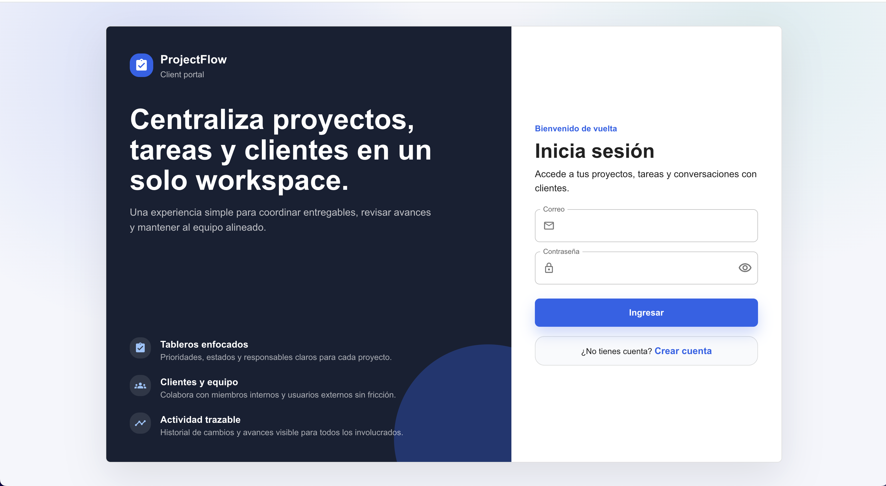
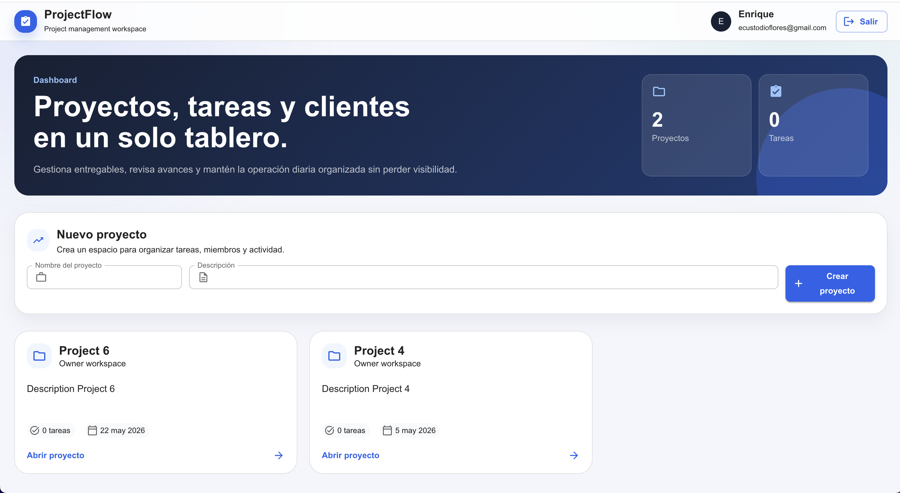
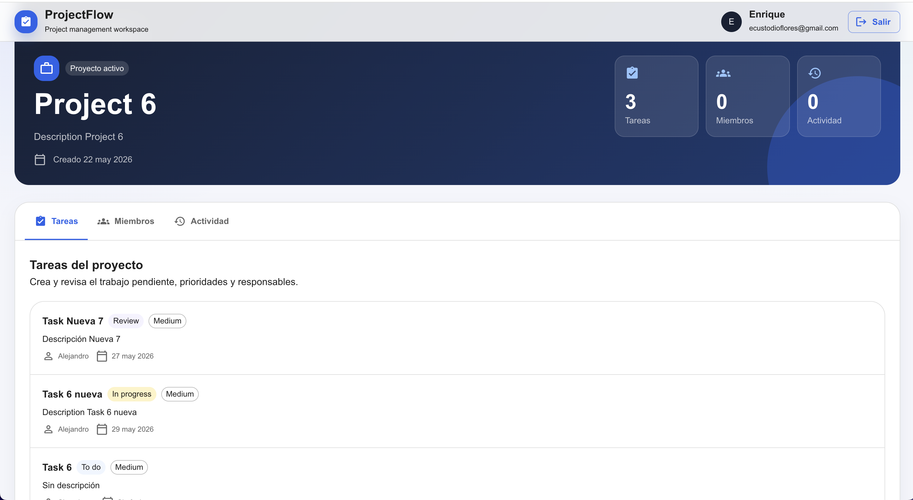
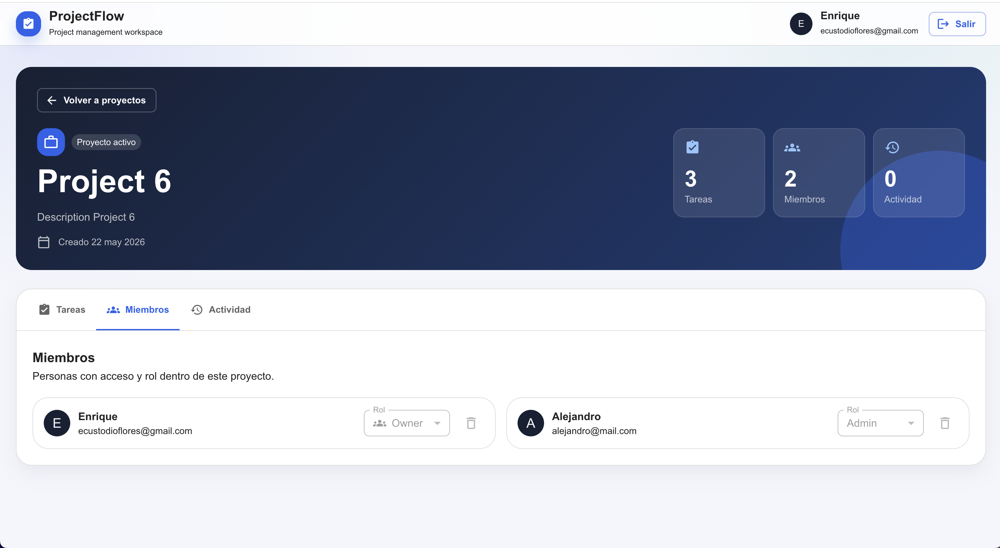
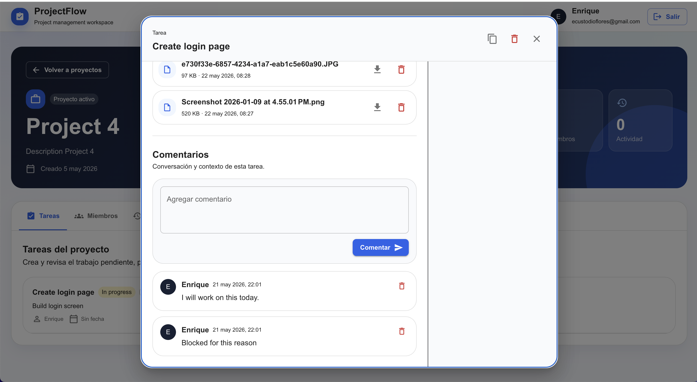

<div align="center">

# 🚀 FlowPilot

### Modern Collaborative Project Management Platform

Plan. Collaborate. Deliver.

A modern full-stack project management platform designed to help teams organize projects, manage tasks, collaborate efficiently, and streamline workflows through secure authentication and scalable architecture.

<p align="center">

[](https://react.dev/)
[](https://www.typescriptlang.org/)
[](https://mui.com/)
[](https://tanstack.com/query)
[](https://aws.amazon.com/cognito/)
[](https://pages.cloudflare.com/)

</p>

</div>

---

# 🌐 Live Demo

**Application**

https://project-management-web.pages.dev/

**Backend API**

https://project-management-api-production-c67f.up.railway.app/api/docs

---

# ✨ Features

## 🔐 Authentication

- AWS Cognito Authentication
- Secure Login
- User Registration
- Email Verification
- Forgot Password
- Password Reset
- Persistent Sessions
- Protected Routes

---

## 📁 Project Management

- Create Projects
- Update Projects
- Delete Projects
- Invite Team Members
- Project Dashboard
- Project Details

---

## ✅ Task Management

- Create Tasks
- Update Tasks
- Delete Tasks
- Assign Members
- Status Management
- Due Dates

---

## 👥 Team Collaboration

- Project Members
- Comments
- File Uploads
- Role-Based Access Control (RBAC)

---

## 🛡️ Security

- AWS Cognito
- JWT Authentication
- Route Protection
- Protected APIs
- Role-Based Authorization
- Secure File Uploads

---

# ⚙️ Tech Stack

| Layer | Technologies |
|---------|-------------|
| Frontend | React 19, TypeScript |
| UI | Material UI (MUI) |
| State Management | TanStack Query |
| Forms | React Hook Form + Zod |
| HTTP | Axios |
| Authentication | AWS Cognito + AWS Amplify |
| Routing | React Router |
| Deployment | Cloudflare Pages |

---

# 🏗️ Architecture

```text
                React + TypeScript
                        │
                        ▼
             React Query + Axios
                        │
                        ▼
             AWS Cognito Authentication
                        │
                        ▼
                 NestJS REST API
                        │
                        ▼
                 PostgreSQL Database
```

---

# 🔒 Authentication Flow

```text
User

 │

 ▼

Login UI

 │

 ▼

AWS Cognito

 │

 ▼

ID Token + Access Token

 │

 ▼

NestJS Authentication Guard

 │

 ▼

User Synchronization

 │

 ▼

Protected REST APIs
```

---

# 👤 Role-Based Access Control (RBAC)

| Role | Permissions |
|-------|-------------|
| OWNER | Full project administration |
| ADMIN | Manage project content and members |
| MEMBER | Create and manage tasks, comments and files |
| VIEWER | Read-only access |

---

# 📂 Project Structure

```text
src
│
├── auth
├── components
├── features
│   ├── auth
│   ├── comments
│   ├── files
│   ├── members
│   ├── projects
│   └── tasks
│
├── hooks
├── layouts
├── routes
├── types
└── utils
```

---

# 🚀 Getting Started

## Clone the repository

```bash
git clone https://github.com/ecustodio123/project-management-web.git
```

## Install dependencies

```bash
npm install
```

## Configure environment variables

Create a `.env` file.

```env
VITE_API_URL=http://localhost:3000

VITE_AWS_REGION=

VITE_COGNITO_USER_POOL_ID=

VITE_COGNITO_CLIENT_ID=
```

## Run the application

```bash
npm run dev
```

---

# 📸 Screenshots

- Login


- Projects


- Tasks


- Members


- Comments & Files


---

# 🧠 What I Learned

During the development of **FlowPilot**, I strengthened my knowledge in:

- Modern React Architecture
- React Query
- AWS Cognito Authentication
- Authentication Flows
- Route Protection
- REST API Integration
- RBAC (Role-Based Access Control)
- Component Architecture
- Scalable Frontend Design
- Cloud Deployment with Cloudflare Pages

---

# 🚀 Future Vision

Planned improvements include:

- Kanban Board
- Calendar View
- Notifications
- Real-Time Collaboration
- Activity Timeline
- AI Assistant
- Mobile Application (React Native)

---

# 🔗 Related Projects

Backend API

https://github.com/ecustodio123/project-management-api

Swagger

https://project-management-api-production-c67f.up.railway.app/api/docs

---

# 👨‍💻 Author

**Enrique Custodio**

React Native & Frontend Engineer

Currently expanding into Full Stack & Cloud Engineering.

---

## ⭐ If you found this project interesting, consider giving it a star!